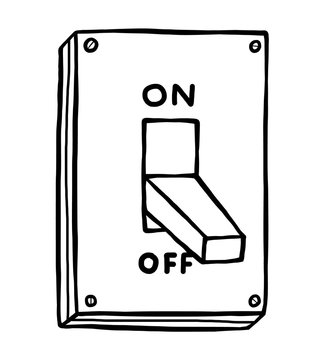

Reflections on Mindfullness and Work

John Kabait Zihn describes mindfulness as the simple act of paying attention on purpose. 

I like to think about this as turning on a switch. 

The off-mode is the mindless state. 

The on-mode is when you're in a mindful state. 

However, unlike most switches, this switch has a tension that slowly pulls it back toward mindlessness or turning off. you can turn the switch on but sometimes the switch feels most comfortable going back to off. Sometimes, it's challenging to notice when it inadvertently switches off. When this happens, it's important to notice when it does turn off and try to turn it back on by simply attempting to purposefully pay attention. 

I've found that for tasks of deep concentration, it's important to have fun and find enjoyment in what you're doing. If you're not enjoying your work, the switch feels a greater pull to turn off towards the mindless state, making it harder to maintain mindfulness. So sometimes I'll reflect about What's enjoyable about what I'm working on and What excites me and What am I hoping to create. 

At times, after prolonged concentration, I can feel tension building in my body, and I might lose awareness, slipping into a mindless state. The physical signs are telling: a bouncing leg, a sense of restlessness that creeps up unnoticed. I'm not enjoying what I'm working on. Once (if) I realize the switch has turned off, taking a deep breath, becoming aware of my body, and deliberately turning the switch back on helps me refocus. And I need to rediscover the fun of the task. 